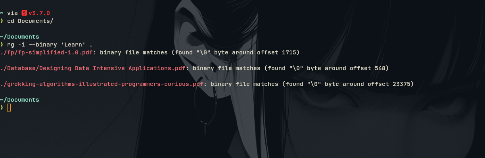
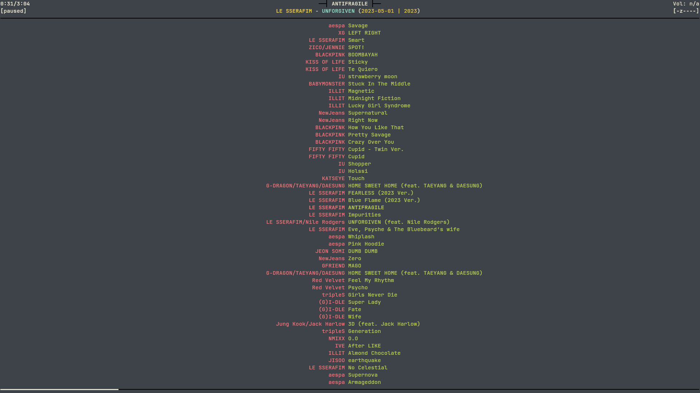
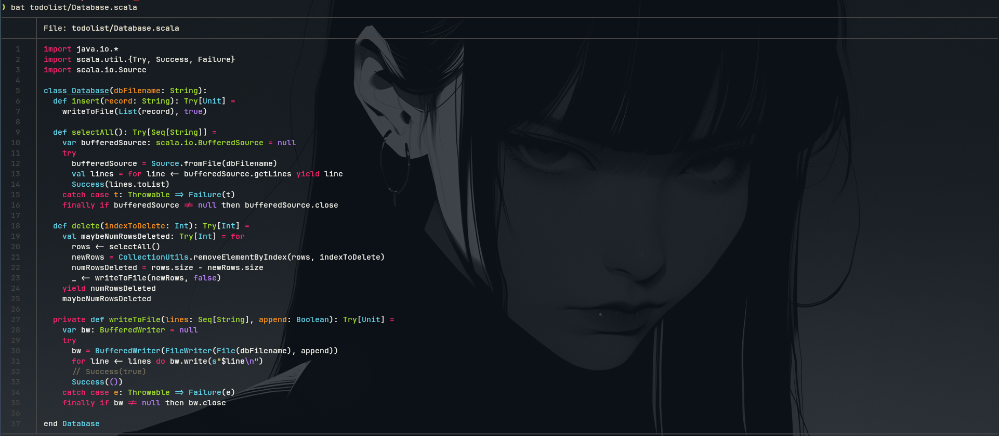

This repository contains all of the system configuration and Command-line tools for my System and Developer configuration.

# Kitty

> Fast feature rich GPU based terminal emulator

# Ripgrep

> Recursively search for a regex better grep written in rust

# ncmpcpp

> Despite its unique name NCurses Music Player Client (Plus Plus) or ncmpcpp is a great music player.

# ncspot

> ncurses spotify client written in Rust using librespot, inspired by ncmpc and the likes

# BAT

> `cat` with wings

